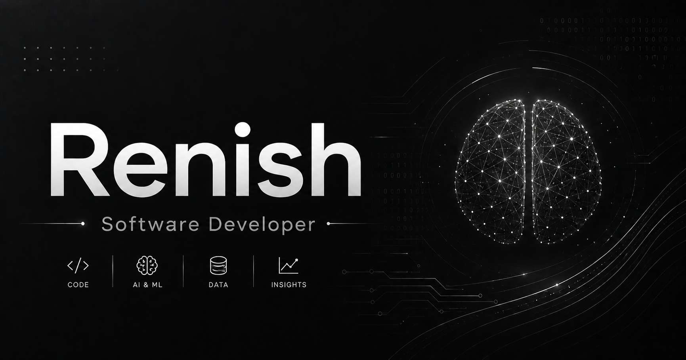

# Renish R — Software Developer Portfolio



A sleek, high-performance personal portfolio built to showcase my projects, technical skills, and journey as a software engineering student. The site highlights my focus on full-stack web development, system design, and continuous learning.

## 🚀 Live Demo
**[View Live Site](https://renish-portfolio-wheat.vercel.app)**

## 🛠️ Tech Stack
- **Framework:** [Next.js 15](https://nextjs.org/) (App Router) + React 19
- **Language:** TypeScript
- **Styling:** [Tailwind CSS v4](https://tailwindcss.com/)
- **Animations:** [Framer Motion v12](https://www.framer.com/motion/)
- **Icons:** [Lucide React](https://lucide.dev/)
- **Contact Form:** [EmailJS](https://www.emailjs.com/)
- **Deployment:** Vercel

## ✨ Features
- **Modern UI/UX:** Fully responsive design utilizing custom glassmorphism components.
- **Fluid Animations:** Custom `useScrollAnimation` hooks and Framer Motion variants for smooth viewport reveals.
- **Interactive Elements:** Dynamic project toggles and a custom interactive glass cursor (bypassed on touch devices).
- **Direct Contact:** Fully functional, client-side contact form routed directly to email via EmailJS.
- **Highly Optimized:** Built with Next.js best practices, including aggressive asset compression and optimized web fonts.

## 💻 Local Development

1. **Clone the repository:**
   ```bash
   git clone [https://github.com/ren-ishh/renish-portfolio.git](https://github.com/ren-ishh/renish-portfolio.git)
   cd renish-portfolio
